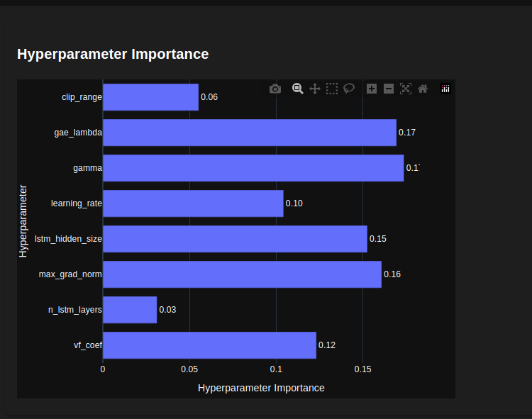

# SISTEM DE TRADING CU REINFORCEMENT LEARNING

## Descrierea proiectului
Proiectul propus vizeaza dezvoltarea unui sistem de trading bazat pe Reinforcement Learning. Sistemul de trading va lua decizii zilnice de tipul buy sau sell, in functie de evolutia preturilor si indicatorilor tehnici ai activelor financiare, in vederea maximizarii profitului pe intervale de timp de minim 30 de zile.

## Metode de implementare
Pentru implementarea sistemului de trading, am antrenat agenti de tip Deep Reinforcement Learning, deoarece starile fiind intr-un numar foarte mare (preturile si indicatorii sunt numere reale, fluctuative, ducand astfel intr-un numar foarte mare de stari ce nu poate fi stocat in forma matriceala), nu pot fi stocate in format tabelar, astfel proiectul nostru prezinta algoritmi de tip Function Approximation.
Lumea financiara este influentata de foarte multi factori externi, fiind totodata si foarte dinamica si noisy. Intuitia noastra este ca o politica stocastica se va comporta mai bine pe problema prezentata. Nu intotdeauna o actiune data este cea mai buna avand in vedere informatiile pe care le detine sistemul, astfel, cu ajutorul acestui tip de politica, este mult mai bine gestionat trade-off-ul dintre explorare si exploatare. Asadar, avand in vedere o schimbare mai drastica in piata, sistemul se poate adapta mai bine. Intuitia noastra se concluzioneaza a fi adevarata, si va fi demonstrata in sectiunea de rezultate.

## Datele utilizate
Pentru antrenare, am folosit un set de date de la Google, colectat de autorul enviromentului pe care l-am folosit, ce are 2335 de exemple din perioada 2009-2018. Formatul datelor este urmatorul: data la care este inregistrat pretul, pretul de deschidere si de inchidere, pretul de inchidere dupa acordarea dividentelor, cel mai mic si cel mai mare pret din ziua respectiva, si volumul de actiuni tranzactionate in aceea zi. 
Pentru testare, am obtinut mai multe seturi de date de pe Yahoo Finance, din 2015(pentru companiile listate la bursa pana in 2015 inclusiv), pana in 2023 (01.01.2015-31.12.2023), ce respecta acelasi format ca datele de antrenare. Activele pentru care am obtinut datele de testare sunt: Tesla, Ethereum, Bitcoin, Google,Amazon, Apple, Microsoft, Netflix, Spotify, PayPal, Nike, Disney, AMD, Intel, Nvidia, IBM, Alibaba, Uber, Airbnb

## Descrierea mediului
Mediul de tranzactionare este definit utilizand o varianta personalizata a mediului de tranzactionare Gym Anytrading, mai exact eviromentul stockenv din acest framework.Am pastrat calcularea profitului (calculat la nivel procentual), pozitiile (long cand agentul cumpara ieftin pentru a vinde la un pret mai mare, si short cand vinde la un pret mare pentru a cumpara la un pret mai mic), actiunile (cumpara si vinde), window size (numarul de zile dintr-o observatie/stare) si comisionul de vanzare de 1% din valoarea pretului la care s-a vandut si comisionul de cumparare de 0,5% pe care il solicita platforma de tranzactionare. Modificarile aduse de catre noi sunt urmatoarele: 

### Definirea starii mediului
Starea unde se poate afla agentul este reprezentata de: pretul (de inchidere, utilizat in mod standard in acest context), volumul de actiuni tranzactionate, pretul de deschidere, pretul de inchidere, cel mai mic si cel mai mare pret, Triple Exponential Moving Average (TEMA 30, in ce directie se indreapta trendul pe parcursul a 30 zile, cu accent mai mare pe ultimele zile. Luand decizii de cumparare si vanzare in fiecare zi, am considerat sa punem un accent mai mare pe ultimele zile de tranzactionare), Kaufman Efficency Indicator (ER, indicator pentru confirmarea trendului,este intre -1 si 1, -1 = downtrend, 1 = uptrend, aprox. 0 = random), Relative Strength Index (RSI, indicator pentru confirmarea trendului, este intre 0 si 100, 30-70 = interval de interes, 0-30 = oversold, 70-100 = overbought), On-Balance Volume (OBV, indicator pentru confirmarea trendului, bazat pe volumul de tranzactii din ziua respectiva), Stochastic Oscillator (STOCH, indicator pentru confirmarea trendului, este intre 0 si 100, 20-80 = interval de interes, 0-20 = oversold, 80-100 = overbought), toate acestea fiind exprimate la nivelul unei zile.

### Calcularea recompensei
Pentru calcularea recompensei, am incercat mai multe abordari:
1. recompensa originala din enviroment, care este calculata doar atunci cand se realizeaza un trade de tip long (cazul in care cumpara ca sa vanda mai scump) si este definita ca diferenta dintre pretul la data curenta si pretul din ziua in care a cumparat ultima oara; [figura 1]
2. recompensa originala, insa in loc de diferenta dintre preturi, se acorda o recompensa de +1 in cazul in care pretul la care s-a vandut este mai mare decat pretul la care s-a cumparat ultima data, si -1 in caz contrar; [figura 2]
3. asemanator cu functia de recompensa de la subpunctul 2, insa se acorda recompensa +1 si pentru cazul in care in ziua respectiva agentul a cumparat la un pret mai mic, si inainte a vandut la un pret mai mare decat pretul cumpararii actuale, iar in caz contrar -1. De asemenea, in ambele situatii se scade 0.1 in cazul in care preturile sunt egale; [figura 3]
4. recompensa ca in cazul subpunctului 3, insa s-a urmarit principiul de reward shaping, in care se acorda recompense intermediare pentru o convergenta mai rapida, fiind de ajutor mai ales la inceput, cand agentul nu este destul de destept, avand o traiectorie care nu ii aduce recompense mult prea bune, si cand recompensele finale sunt destul de rare. Astfel, in cazul in care agentul cumpara, iar inainte pozitia lui era pe long (a cumparat) si pretul urmatoarei zile este mai mare decat pretul zilei curente, acesta primeste o recompensa de +0.5, altfel primeste -0.5. In situatia in care agentul vinde, iar inainte pozitia lui era pe short (a vandut) si pretul curent este mai mare decat pretul zilei urmatoare, acesta primeste o recompensa de +0.5, altfel primeste -0.5; [figura 4]
5. functia de recompensa cu numarul 5 asemanator cu subpunctul 4, insa in cazul recompenselor intermediare nu s-au mai acordat recompensele fixe de +0.5 sau -0.5, ci in cazul in care pozitia agentului este pe long, si in ziua respectiva a cumparat, va primi diferenta dintre pretul urmatoarei zile si pretul curent, iar in cazul in care agentul se afla pe pozitie short, si in ziua respectiva a vandut, va primi diferenta dintre pretul curent si pretul urmatoarei zile. [figura 5]

#### Evaluarea functiilor de recompensa
Am testat fiecare functie de recompensa cu ajutorul unui model recurent Proximal Policy Optimization (care va fi detaliat in sectiunea agenti), pe un numar total de timesteps de 20000 cu parametrii impliciti, pe 100 de episoade, pe datasetul de antrenare (80% din dataset l-am folosit pentru antrenare, si 20% pentru evaluare- aprox. 450 de zile). Am obtinut urmatoarele rezultate pe care le vom afisa in graficile de mai jos. Dupa cum se observa, cea mai buna recompensa care genereaza si profituri bune, dar in acelasi timp profitul si recompensa sunt destul de corelate, este cea de la punctul (5). Evidenta este atat empirica, cat si intuitiva, deoarece am aplicat conceptul de reward shaping, iar recompensele finale sunt normalizate. Chiar daca recompensele intermediare nu sunt normalizate, acestea nu sunt foarte mari ca sa impacteze in mod negativ algoritmii, introducand o componenta de stocasticitate pentru a trece de optimele locale. 

*figura 1*

*figura 2*

*figura 3*

*figura 4*

*figura 5*

## Agentii
### DQN
Pentru implementarea sistemului de trading am utilizat doi algoritmi. 
Primul algoritm este Deep Q Network, unde, in loc de un MLP clasic sau o retea convolutionala, am folosit o retea formata din doua layere de Long Short Term Memory (LSTM), cu hidden size 64, un layer fully connected de hidden size 64, si dropout atat pentru layerele de LSTM cat si pentru cele de fully connected de 0.2, deoarece datele sunt secventiale, si este importanta ordinea in care sunt prezentate. Am folosit un gamma de 0.95, epsilon de 0.99, epsilon minim de 0.05, epsilon decay de 0.9 / 100000, learning rate de 0.001. Algoritmul foloseste replay buffer, cu un numar minim de stari de la care incepe antrenarea de 50000, si maximul numarului de stari din memorie este de 1000000. Am antrenat pe 400 de episoade. Algoritmul respecta structura de la laborator, modificarea noastra fiind introducerea retelelor recurente in acesta.

### PPO
Al doilea algoritm pe care l-am aplicat asupra enviromentului este o varianta recurenta al algoritmului Proximal Policy Optimization (PPO), implementata in stable_baselines3 (varianta contrib a acestuia). 
Algoritmul prezentat este o varianta mai simplificata a Trust Region Policy Optimization (TRPO). TRPO este la randul sau o adjustare mai stabila a algoritmului Vanilla Policy Gradiant. PPO este un algoritm de tip policy-based (acesta ajuteaza direct politica, nu prin intermediul unui value function sau action value function) si on-policy (deoarece isi sample-uieste traiectoriile din propria politica si isi alege cea mai optima actiune tot conform politicii sale). Acest algoritm presupune o politica stocastica, ceea ce ne ajuta foarte mult in situatia noastra. Am folosit varianta actor critic a algoritmului pentru a combina avantajele metodelor policy based cu cele a metodelor value based, aducand diferite avantaje, precum convergenta mai rapida si stabilitatea, insa complexitatea creste.
In prima instanta, algoritmul isi sample-uieste traiectoriile si isi calculeaza avantajul pentru fiecare timestamp, conform informatiilor detinute la acel moment. Aceste informatii reprezinta, in cazul variantei actor critic, diferenta dintre discounted rewards (calculat incepand cu timestamp-ul curent) si value function din starea curenta (calculat de reteaua critic a modelului). Algoritmul fiind bazat pe policy gradient, foloseste o parte din loss function-ul acestuia: $E_t[\log \pi_\theta (a_t|s_t) \cdot A_t]$, unde $\pi_\theta$ este politica, $a_t$ este actiunea, $s_t$ este starea, iar $A_t$ este avantajul. Functia aceasta se poate traduce ca: atunci cand gradientul este pozitiv, probabilitatea ca fiind in starea $s_t$ sa ia actiunea $a_t$ creste, iar cand este negativ, probabilitatea scade. Avantajul se traduce ca fiind diferenta dintre ceea ce stim si ceea ce a prezis reteaua critic ca se va intampla. Astfel, cand reteaua critic se subestimeaza si recompensa adevarata este mai mare, creste probabilitatea,in viitor, ca fiind in starea t sa aleaga actiunea t. Iar cand reteaua critic se supraestimeaza, probabilitatea ca fiind in starea t sa fie aleasa actiunea t scade. TRPO vine cu o ajustare pentru a stabiliza algoritmul, si anume cu faptul ca politica este updatata fara a se departa prea tare de politica anterioara. Aceasta departare de politica anterioara este data de $KL(\pi_{old},\pi_{new})$, care trebuie sa fie mai mica decat o constanta setata. PPO vine cu o ajustare a algoritmului TRPO, simplificandu-l, aplicand asupra functiei de loss un clip, astfel incat sa nu se departeze prea mult de politica anterioara. Loss function-ul este completat de un termen care reprezinta loss-ul pentru reteaua critic (ce calculeaza value function-ul, in cazul in care parametrii sunt impartiti, altfel se adapteaza separat) si de un coeficient de entropie ce ajuta la randomness-ul politicii pentru explorare. Ambele retele, atat actor, cat si critic, sunt adaptate in directia gradientului pentru maximizarea recompensei folosind algoritmi pentru optimizare de tip gradient ascent.
Dupa cum se observa din graficile atasate, intuitia noastra s-a dovedit a fi adeverata, iar agentul recurent PPO depasteste agentul recurent DQN.
Agentul recurent PPO a fost tunat folosind framework-ul de tunare de hyperparametrii, timp de 20000 de timesteps, unde am ajuns la un maxim de profit de 48% pe datele pe care l-am antrenat.

*figura 20 axa Ox reprezinta numarul modelului tunat iar axa Oy reprezinta profitul obtinut*

*figura 21 importanta hiperparametriilor in raport cu performanta, obtinuta in urma tunarii cu framework-ul Optuna*

## Rezultate 
Pentru testarea agentilor am folosit seturile de date descrise anterior, de unde am sustras ultimele n zile (cu n = 30, 60, 90, 120, 210, 365, 730) cu mentiunea ca pentru datasetul Airbnb am avut doar 700 de zile deoarece doar atat am avut la dispozitie. Am testat pe 50 de episoade si am facut media in cazul PPO (fiind stocastic) si pe un singur episod in cazul DQN (fiind determinist). Am obtinut rezultatele afisate in graficele de mai jos.

*figura 6 DQN*

*figura 7 PPO*

*figura 8 DQN*

*figura 9 PPO*

*figura 10 DQN*

*figura 11 PPO*

*figura 12 DQN*

*figura 13 PPO*

*figura 14 DQN*

*figura 15 PPO*

*figura 16 DQN*

*figura 17 PPO*

*figura 18 DQN*

*figura 19 PPO*

## Concluzia 
Rezultatele arata ca se aplica foarte bine algoritmii cu retele recurente cu o politica stocastica (Recurrent PPO), insa si Deep Q-Network-ul a avut rezultate satisfacatoare. De asemenea, conceptul de reward shaping a ajutat foarte mult la o convergenta mai buna si mai rapida. 